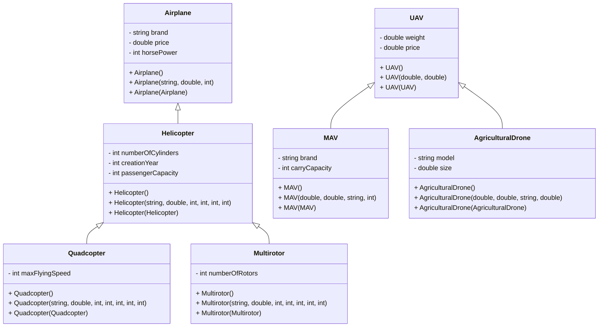

# Polymorphism Vehicles Program

## Overview
This solution demonstrates polymorphism within a vehicle context. The project is split into several sub-projects:
- **DriverProgram**: Contains the main entry point.
- **NS_Airplane**: Defines the base Airplane class.
- **NS_HelicopterQuadcopter**: Contains Helicopter, Quadcopter classes.
- **NS_Multirotor**: Contains the Multirotor class (inherits from Helicopter).
- **NS_UAV**: Defines the base UAV class.
- **NS_Agricultural_MAV**: Contains MAV and AgriculturalDrone classes (inherit from UAV).

## Structure
- The solution file (.sln) is at the project root.
- Each project is contained within its respective folder.

## UML Diagram
Below is a Mermaid UML diagram representing the structure:



## Running the Application
1. Open the solution in Visual Studio or your preferred IDE.
2. Alternatively, run the application from the command line:
   - Navigate to the solution directory.
   - Execute:
     ```bash
     dotnet run --project DriverProgram
     ```
3. The application will display a "Hello World!" message as a basic proof-of-concept.